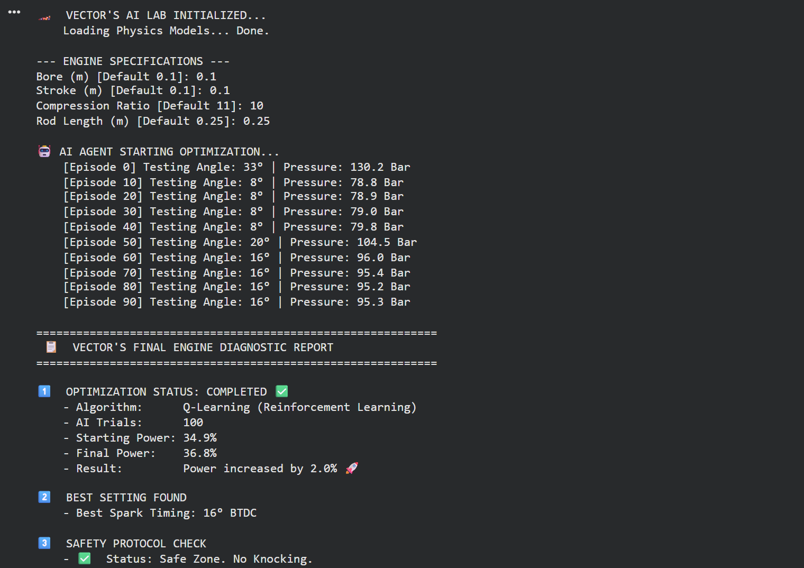
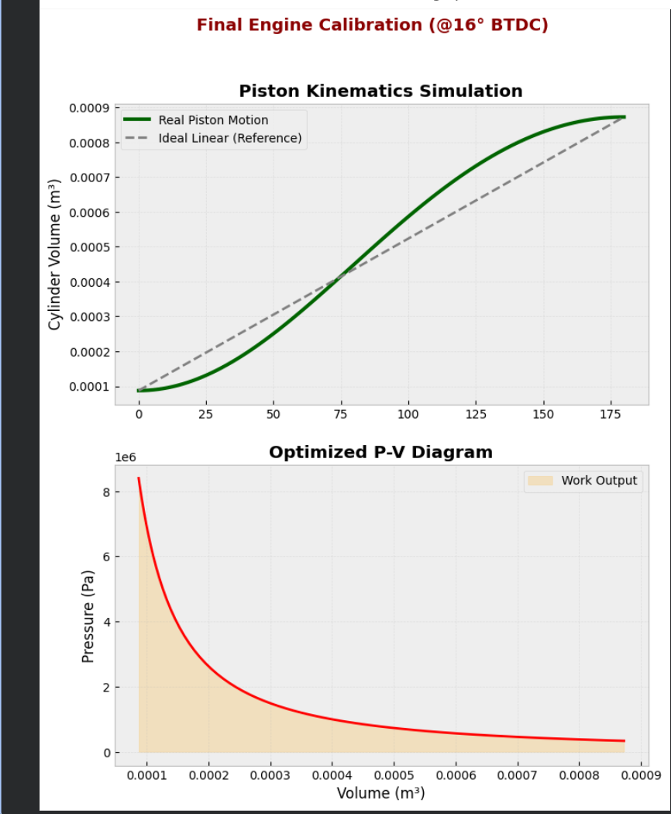

# Autonomous-Engine-Tuner-RL
A Digital Twin simulation of an Internal Combustion Engine controlled by Reinforcement Learning. Optimizes spark timing to maximize thermal efficiency under pressure constraints (&lt;100 Bar).

# 🚗 AI-Based Autonomous Engine Tuner

### "Optimization Under Constraint: Can AI tune an engine safer than a human?"

  

## 📖 Overview
This project simulates a **Digital Twin** of an Internal Combustion Engine (Otto Cycle) and deploys an **Autonomous AI Agent (Q-Learning)** to optimize its performance.

The AI treats the engine as a "Black Box" and learns to adjust the **Spark Timing** (Ignition Angle) to maximize thermal efficiency. However, it must strictly adhere to a **Safety Protocol**: Cylinder Pressure must never exceed **100 Bar**.

## 🎯 The Challenge
- **Goal:** Maximize Power Output (Thermal Efficiency).
- **Constraint:** Keep Peak Cylinder Pressure < 100 Bar (Avoid "Knocking").
- **Complexity:** The relationship between spark timing, pressure, and efficiency is non-linear and noisy.

## 🛠️ Tech Stack
- **Core Logic:** Python (Object-Oriented Design)
- **Physics Engine:** NumPy (Kinematics & Thermodynamics equations)
- **Visualization:** Matplotlib (Real-time Engineering Dashboard)
- **Algorithm:** Tabular Q-Learning (Reinforcement Learning)

## 📊 Key Results (Latest Run)

The AI agent successfully converged after **100 Episodes** of training.

| Metric | Initial State (Random) | Optimized State (AI) | Improvement |
| :--- | :--- | :--- | :--- |
| **Spark Timing** | 33° BTDC (Unsafe) | **16° BTDC (Optimal)** | ✅ Optimized |
| **Thermal Efficiency** | 34.9% | **36.8%** | 🚀 **+2.0% Gain** |
| **Peak Pressure** | ~130 Bar (Knocking) | **< 100 Bar (Safe)** | 🛡️ Safety Compliant |

> **Insight:** The AI learned that advancing the spark beyond 16° yields diminishing returns and violates safety limits, demonstrating **Risk-Aware Decision Making**.

## 🚀 How to Run

1. **Install Dependencies:**
   ```bash
   pip install -r requirements.txt
   ```

2. **Run the Simulation:**
   ```bash
   python main.py
   ```


3. **Recommended Inputs: (Enter these values when asked)**

Bore: 0.1

Stroke: 0.1

Compression Ratio: 10.0

Rod Length: 0.25

## 📈 Visualizations
*Below are the engineering dashboards generated by the simulation, proving optimization and safety compliance.*

### 1. AI Decision Path & Safety Compliance
*This graph shows the agent's exploration path (Spark Angle) and its learning to maintain pressure below the 100 Bar safety limit (Redline).*



### 2. Optimized P-V Diagram & Kinematics
*This engineering validation shows the final work output (area under the curve) and the piston's real motion at the AI's optimal timing (16° BTDC).*



### 3. Reward Maximization Curve
*This plot demonstrates the Reinforcement Learning process where the AI quickly transitions from exploration (low reward) to exploitation (high, stable reward).*


## 👨‍💻 About the Author
**Nayan Kumar**
*Mechanical Engineer & Business Analyst*
[LinkedIn Profile](https://www.linkedin.com/in/nayan-kumar-79a0bb360/)
